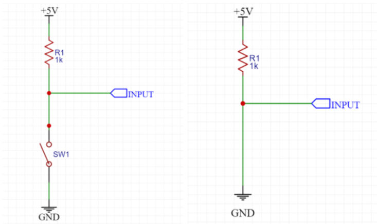

# iot-raspi-2025

## 1일차
### 기본 설정
공유기 연결 후 인터넷 창 - 192.168.0.1 접속
- 기존 PC의 ip주소 입력 및 기본 설정

### 설치
- raspberry Pi Imager (https://www.raspberrypi.com/software/) 
    > Download for Windows
- RealVNC (https://www.realvnc.com/en/connect/download/viewer/?lai_vid=8rnEvy4v2CBa3&lai_sr=0-4&lai_sl=l)
- SD Card Formatter (https://www.sdcard.org/downloads/formatter/sd-memory-card-formatter-for-windows-download/)
    > Accept
    - sd 카드 포맷용으로 사용 (라즈베리파이 오류 시 시행)

#### raspberry Pi Imager 
1. 라즈베리파이디바이스 선택(버전 확인)
2. 운영체제 선택(Raspberry pi os (64-bit))
3. 저장소 선택 (pc에 연결한 sd 카드 선택)

#### 공유기 - raspberrypi 연결
1. 유선 LAN 연결 (raspberrypi - 공유기)
2. 모니터 연결 (raspberrypi - 모니터)
3. 키보드, 마우스 연결 (raspberrypi - 키보드/마우스)
4. raspberrypi 배경화면 > 우측 상단 인터넷 아이콘 클릭 > 연결할 공유기 찾기 > 아이디/비번 넣고 연결
5. restart (후에도 연결되어 있는지 확인)
6. 네트워크 매니저 창에 raspberrypi 연결되어 있는지 확인

#### PUTTY
1. Host Name : raspberrt.local(네트워크 매니저에서 확인한 raspberrypi ip 입력)
2. Port : 22
3. Saved Sessions : raspi
3. save -> load -> open
4. 터미널에서 명령어 실행
```shell
    sudo apt update
    sudo apt upgrade -y
    sudo reboot now
```
5. 창 상단 우클릭 > Changed Sessions > restart Sessions
6. vnc 활성화
```shell
    vncserver-virtual
    sudo raspi-config 
```
7. 화면 출력 시 3. Interface Options > I3 VNC > Yes > Finish

#### RealVNC
1. 실행 후 raspberrypi 입력
2. 이름/비번 : raspi/raspi

##### 한글 설정
1. vnc뷰어에서 raspberrypi 아이콘 클릭 > raspberrypi configuration > localiziation 으로 이동
2. location - ko(korean), KR, UTF-8로 변경
3. Timezone - Asia, Seoul로 변경
4. 터미널에서 명령어 실행
```shell
    sudo apt install fonts-nanum fonts-nanum-extra   #나눔 폰트 설치
    sudo apt install fonts-unfonts-core   #폰트 등록
    sudo reboot now
    sudo raspi-config # vnc 활성화
```

#### 라즈베리파이 Shared 파일 설치
1. 터미널에서 명령어 실행
```shell
    sudo apt install samba samba-common-bin
    sudo mkdir -p /home/pi/share
    sudo nano /etc/samba/smb.conf
```
2. 편집기에서 가장 마지막 줄에 추가
```nano
    [share]
    path = /home/pi/share
    writeable = yes
    create mask = 0777
    directory mask = 0777
    public = yes
    guest ok = yes
```
3. samba restart
```shell
    sudo systemctl restart smbd
```
4. 권한 오류 발생
```shell
    sudo chmod -R 777 /home/pi/share
```
-> 모든 사용자에게 권한 부여

5. 윈도우파일탐색기 > 라즈베리파이의 ip주소 입력


#### 라즈베리 설정
- 편집기 열어서 수정
```shell
    sudo nano /etc/nanorc
```
- 주석 해제 
	- set autoindent
	- set linenumbers
	- set tabsize 4


#### 명령어
|명령어|설명|
|------|----|
|ls -al [파일명] | 자세히 보기|
|ls| 파일 목록 보기|
|ls *.[파일확장자] | 해당 파일 확장자 모두 보기|
|rm -fr [파일명/*].[확장자명] | 파일 삭제|
|cp ./[파일명1] ./[파일명2] | 파일명을 1에서 2로 복사|
|mv [파일명1] [파일명2] | 파일명 1을 2로 변경|
|pwd | 현재 위치 |
|rmdir [폴더명] | 폴더 삭제 |
. : 현재 디렉터리
.. : 상위 디렉터리


## 2일차

### RPI.GPIO 모듈
GPIO.setmode(GPIO.BOARD)		# WPI (물리적 핀 번호 사용)
GPIO.setmode(GPIO.BCM)		# BCM (GPIO 번호 사용)
GPIO.setup(channel, GPIO.IN)  	# 입력으로 설정 (ex 버튼)
GPIO.setup(channel, GPIO.OUT)    # 출력으로 설정 (ex led)
GPIO.cleanup()				# 모든 핀 초기화
GPIO.output(channel, HIGH)		# 출력 핀을 HIGH (3.3V)
GPIO.output(channel, LOW)		# 출력 핀을 LOW (0V)

### VCC vs GND
| 구분        | 역할               | 예시                            |
| --------- | ---------------- | ----------------------------- |
| VCC       | 전원 (+)           | 3.3V 또는 5V 핀                  |
| GND       | 접지 (-)           | 0V 기준점                        |
| GPIO.HIGH | GPIO 핀에서 3.3V 출력 | `GPIO.output(pin, GPIO.HIGH)` |
| GPIO.LOW  | GPIO 핀에서 0V 출력   | `GPIO.output(pin, GPIO.LOW)`  |

### 풀업/풀다운 저항
#### 풀업 저항 (Pull-up Resistor)
- 목적: 입력이 연결되지 않았을 때 입력을 HIGH(1) 상태로 유지
- 스위치를 눌렀을 때는 → GND로 연결되어 LOW
- 저항은 VCC와 입력 사이에 존재함
    + 전류가 VCC에서 GND로 바로 흐르지 않도록 보호하는 역할도 부가적으로 맞음
    → 스위치가 눌렸을 때 저항이 없으면 단락(short)될 수 있음


#### 풀다운 저항 (Pull-down Resistor)
- 목적: 스위치를 누르지 않았을 때 입력을 LOW(0) 상태로 유지
- 스위치를 누르면 VCC와 직접 연결되어 HIGH
- 저항은 입력과 GND 사이에 존재함
    + 스위치 OFF일 때 입력을 0으로 보내기 위함


### RGB LED 연결
##### 🔌 하드웨어 연결
**RGB LED 모델: CNT1**
|LED 핀|라즈베리파이 핀|기능|
|------|---------------|----|
|CNT1 -|GND|공통 캐소드 (음극)|
|R|GPIO 14|빨간색 LED 제어|
|G|GPIO 15|초록색 LED 제어|
|B|GPIO 18|파란색 LED 제어|

- 회로 구성도


- 전류 흐름
    - LED가 켜지려면 양극(+) -> 음극(-) 방향으로 흘러야 함
    ```
    GPIO 14 (HIGH, 3.3V) → [저항] → LED 빨간색 → CNT1 - (GND, 0V)
    ```
- [RGB LED 코드](./day02/led.py)


### 스위치 버튼 연결
##### 🔌 하드웨어 연결
**스위치 버튼 모델: S1**
|버튼 핀|라즈베리파이 핀|기능|
|------|---------------|----|
|S|GPIO 17|신호 출력(버튼 상태 감지)|
| (공백)|3.3V|전원 공급|
|-|GND|접지(그라운드)|

- 회로 구성도


- 전기적 동작
    - 버튼 안 눌렸을 때 : S핀이 플로팅 상태(불안정)
        ```
        3.3V ----[풀업저항]---- GPIO 17 ---- (버튼 열림) ---- GND
        ```
    - 버튼 눌렸을 때 : S핀이 3.3v와 연결 -> LOW
        ```
        3.3V ----[풀업저항]---- GPIO 17 ---- (버튼 닫힘) ---- GND (0V)
        ```

[스위치 버튼 코드](./day02/button.py)

**🔄 동작 순서**
1. 평상시: S핀이 3.3V와 연결되어 HIGH(1)
2. 버튼 누름: GND와 직접 연결 LOW(0)
3. 버튼 뗌: 다시 풀다운 저항으로 HIGH

#### 스위치 클릭에 따른 버튼 색 변환
- 한 번 누르면 LED OFF 
- 두 번 누르면 LED RED ON 
- 세 번 누르면 LED GREEN ON
- 네 번 누르면 LED BLUE ON
- 다섯번 누르면 RESET
[구현 코드](./day02/button1.py)

### 파이썬 가상환경 설정
- 가상환경 생성
```shell
    raspi@raspberrypi:~/PiSrc $ python -m venv --system-site-package env
```
    <br>
- 가상환경 활성화
    ```shell
    raspi@raspberrypi:~/PiSrc $ ls
    env  hello.py  led.py
    raspi@raspberrypi:~/PiSrc $ cd env
    raspi@raspberrypi:~/PiSrc/env $ cd bin
    raspi@raspberrypi:~/PiSrc/env/bin $ ls
    Activate.ps1  activate.csh   pip   pip3.11  python3
    activate      activate.fish  pip3  python   python3.11
    raspi@raspberrypi:~/PiSrc/env/bin $ source activate
    ```
<br>

- 파일 생성 및 수정
```shell
    (env) raspi@raspberrypi:~/PiSrc $ nano button.py
```
    -> 가상환경에서는 (가상환경이름) 뜸
<br>

- 실행
```shell
    (env) raspi@raspberrypi:~/PiSrc $ python button.py
``` 
    -> python 파일명
<br>
- 가상환경 비활성화

```shell
    (env) raspi@raspberrypi:~/PiSrc/env/bin $ deactivate
```