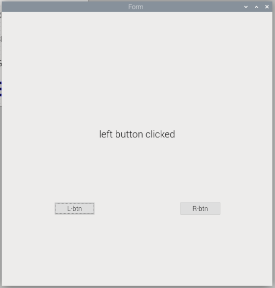
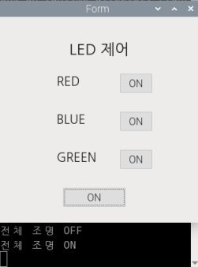

# iot-raspi-2025

## 📅 1일차: 기본 설정
### ✨ 공유기 연결
- 인터넷 창 연결: 192.168.0.1 입력 ▶ 기존 PC IP정보로 가속 설정

### 💾 설치 필수 프로그램
- [raspberry Pi Imager](https://www.raspberrypi.com/software/) 
    > Download for Windows
- [RealVNC](https://www.realvnc.com/en/connect/download/viewer/?lai_vid=8rnEvy4v2CBa3&lai_sr=0-4&lai_sl=l)
- [SD Card Formatter](https://www.sdcard.org/downloads/formatter/sd-memory-card-formatter-for-windows-download/)
    > Accept
    - sd 카드 포맷용으로 사용 (라즈베리파이 오류 시 시행)

### 📀 Raspberry Pi Imager 사용 방법
1. Raspberry Pi 버전 선택 (ex. Pi 4, Pi 5)
2. OS 선택: `Raspberry Pi OS (64-bit)`
3. 저장소 선택: 연결한 SD 카드

#### 공유기 - raspberrypi 연결
1. Raspberry Pi 가 공유기에 LAN 연결
2. 모니터, 키보드, 마우스 연결
3. raspberrypi 배경화면 > 우측 상단 인터넷 아이콘 클릭 > 연결할 공유기 찾기 > 아이디/비번 넣고 연결
4. restart (후에도 연결되어 있는지 확인)
5. 네트워크 매니저 창에 raspberrypi 연결되어 있는지 확인

### ⚡ PUTTY 연결
1. Host Name : raspberrt.local(네트워크 매니저에서 확인한 raspberrypi ip 입력)
2. Port : 22
3. Saved Sessions : raspi
3. save -> load -> open
4. 터미널에서 명령어 실행
    ```shell
    sudo apt update
    sudo apt upgrade -y
    sudo reboot now
    ```
5. 창 상단 우클릭 > Changed Sessions > restart Sessions
6. vnc 활성화
    ```shell
    vncserver-virtual
    sudo raspi-config 
    ```
7. 화면 출력 시 `3.Interface Options > I3 VNC > Yes > Finish`

### 🌐 VNC Viewer
* `vncserver-virtual`
* `sudo raspi-config` ▶ `Interface Options > VNC > Enable`
* RealVNC Viewer에 raspberrypi.local 입력 ▶ ID/PW: `raspi / raspi`

#### 한글 설정
1. vnc뷰어에서 raspberrypi 아이콘 클릭 > raspberrypi configuration > localiziation 으로 이동
2. location - ko(korean), KR, UTF-8로 변경
3. Timezone - Asia, Seoul로 변경
4. 터미널에서 명령어 실행
    ```bash
    sudo apt install fonts-nanum fonts-nanum-extra   #나눔 폰트 설치
    sudo apt install fonts-unfonts-core   #폰트 등록
    sudo reboot now
    sudo raspi-config # vnc 활성화
    ```

### 📝 Shared 파일 설정
1. 터미널에서 명령어 실행
    ```bash
    sudo apt install samba samba-common-bin
    sudo mkdir -p /home/pi/share
    sudo nano /etc/samba/smb.conf
    ```
2. 편집기에서 가장 마지막 줄에 추가
    ```ini
    [share]
    path = /home/pi/share
    writeable = yes
    create mask = 0777
    directory mask = 0777
    public = yes
    guest ok = yes
    ```
3. samba restart
    ```bash
    sudo systemctl restart smbd
    ```
4. 권한 오류 발생 -> 모든 사용자에게 권한 부여
    ```bash
    sudo chmod -R 777 /home/pi/share
    ```
▶ Windows에서 `\\<raspberrypi-ip>` 입력


#### 라즈베리 설정
- 편집기 열어서 수정
    ```bash
    sudo nano /etc/nanorc
    ```
- 주석 해제 
	- set autoindent
	- set linenumbers
	- set tabsize 4

#### 명령어
|명령어|설명|
|------|----|
|ls -al [파일명] | 자세히 보기|
|ls| 파일 목록 보기|
|ls *.[파일확장자] | 해당 파일 확장자 모두 보기|
|rm -fr [파일명/*].[확장자명] | 파일 삭제|
|cp ./[파일명1] ./[파일명2] | 파일명을 1에서 2로 복사|
|mv [파일명1] [파일명2] | 파일명 1을 2로 변경|
|pwd | 현재 위치 |
|rmdir [폴더명] | 폴더 삭제 |
. : 현재 디렉터리
.. : 상위 디렉터리

#### PuTTY 글꼴 변경
`PuTTY 열기 (PuTTY Configuration) > Session > 설정할 session 선택 > load >
좌측 Appearance 에서 글꼴 지정 > Open`
<br>

## 📅 2일차: GPIO 경우 & LED
### ⚡ GPIO 기본
```python
GPIO.setmode(GPIO.BOARD)		# WPI (물리적 핀 번호 사용)
GPIO.setmode(GPIO.BCM)		    # BCM (GPIO 번호 사용)
GPIO.setup(channel, GPIO.IN)  	# 입력으로 설정 (ex 버튼)
GPIO.setup(channel, GPIO.OUT)   # 출력으로 설정 (ex led)
GPIO.cleanup()				    # 모든 핀 초기화
GPIO.output(channel, HIGH)		# 출력 핀을 HIGH (3.3V)
GPIO.output(channel, LOW)		# 출력 핀을 LOW (0V)
```
### VCC vs GND
| 구분        | 역할               | 예시                            |
| --------- | ---------------- | ----------------------------- |
| VCC       | 전원 (+)           | 3.3V 또는 5V 핀                  |
| GND       | 접지 (-)           | 0V 기준점                        |
| GPIO.HIGH | GPIO 핀에서 3.3V 출력 | `GPIO.output(pin, GPIO.HIGH)` |
| GPIO.LOW  | GPIO 핀에서 0V 출력   | `GPIO.output(pin, GPIO.LOW)`  |

### 풀업/풀다운 저항
#### 풀업 저항 (Pull-up Resistor)
- 목적: 입력이 연결되지 않았을 때 입력을 HIGH(1) 상태로 유지
- 스위치를 눌렀을 때는 → GND로 연결되어 LOW
- 저항은 VCC와 입력 사이에 존재함
    + 전류가 VCC에서 GND로 바로 흐르지 않도록 보호하는 역할도 부가적으로 맞음
    → 스위치가 눌렸을 때 저항이 없으면 단락(short)될 수 있음


#### 풀다운 저항 (Pull-down Resistor)
- 목적: 스위치를 누르지 않았을 때 입력을 LOW(0) 상태로 유지
- 스위치를 누르면 VCC와 직접 연결되어 HIGH
- 저항은 입력과 GND 사이에 존재함
    + 스위치 OFF일 때 입력을 0으로 보내기 위함


## 라즈베리파이 핀 설계도
```bash
> pinout
```


## 🌟 RGB LED (CNT1)
### 🔌 하드웨어 연결
|LED 핀|라즈베리파이 핀|기능|
|------|---------------|----|
|CNT1 -|GND|공통 캐소드 (음극)|
|R|GPIO 14|빨간색 LED 제어|
|G|GPIO 15|초록색 LED 제어|
|B|GPIO 18|파란색 LED 제어|

- 회로 구성도


- 전류 흐름
    - LED가 켜지려면 양극(+) -> 음극(-) 방향으로 흘러야 함
    ```
    GPIO 14 (HIGH, 3.3V) → [저항] → LED 빨간색 → CNT1 - (GND, 0V)
    ```
- [RGB LED 코드](./day02/led.py)


## ⏰ 스위치 & 버튼(S1)
### 🔌 하드웨어 연결
|버튼 핀|라즈베리파이 핀|기능|
|------|---------------|----|
|S|GPIO 17|신호 출력(버튼 상태 감지)|
| (공백)|3.3V|전원 공급|
|-|GND|접지(그라운드)|

- 회로 구성도


- 전기적 동작
    - 버튼 안 눌렸을 때 : S핀이 플로팅 상태(불안정)
        ```
        3.3V ----[풀업저항]---- GPIO 17 ---- (버튼 열림) ---- GND
        ```
    - 버튼 눌렸을 때 : S핀이 3.3v와 연결 -> LOW
        ```
        3.3V ----[풀업저항]---- GPIO 17 ---- (버튼 닫힘) ---- GND (0V)
        ```

        [소스 코드](./day02/button.py)

#### 🔄 동작 순서
1. 평상시: S핀이 3.3V와 연결되어 HIGH(1)
2. 버튼 누름: GND와 직접 연결 LOW(0)
3. 버튼 뗌: 다시 풀다운 저항으로 HIGH

#### 스위치 클릭에 따른 버튼 색 변환
- 한 번 누르면 LED OFF 
- 두 번 누르면 LED RED ON 
- 세 번 누르면 LED GREEN ON
- 네 번 누르면 LED BLUE ON
- 다섯번 누르면 RESET
[구현 코드](./day02/button1.py)

## 💊 가상환경
- 가상환경 생성
    ```bash
    raspi@raspberrypi:~/PiSrc $ python -m venv --system-site-package env
    ```
<br>

- 가상환경 활성화
    ```bash
    raspi@raspberrypi:~/PiSrc $ ls
    env  hello.py  led.py
    raspi@raspberrypi:~/PiSrc $ cd env
    raspi@raspberrypi:~/PiSrc/env $ cd bin
    raspi@raspberrypi:~/PiSrc/env/bin $ ls
    Activate.ps1  activate.csh   pip   pip3.11  python3
    activate      activate.fish  pip3  python   python3.11
    raspi@raspberrypi:~/PiSrc/env/bin $ source activate
    ```
<br>

- 파일 생성 및 수정
    ```bash
    (env) raspi@raspberrypi:~/PiSrc $ nano button.py
    ```
    ` -> 가상환경에서는 (가상환경이름) 뜸`
<br>

- 실행
    ```bash
    (env) raspi@raspberrypi:~/PiSrc $ python button.py
    ``` 
    `-> python 파일명`
<br>

- 가상환경 비활성화
    ```bash
    (env) raspi@raspberrypi:~/PiSrc/env/bin $ deactivate
    ```
<br>


## 📅 3일차: DHT11 온습도 설치 & DB
### 🪨 온습도 센서 (DHT11)
#### 🔌 하드웨어 연결
**온습도 센서 모델: DHT11**
|DHT11 핀|라즈베리파이 핀|기능|
|------|---------------|----|
|S|GPIO 2|데이터 신호 송수신|
|VCC|3.3V|전원 공급|
|GND|GND|접지(그라운드)|

- 회로 구성도


#### 온습도센서 패키지 설치
```bash
pip install adafruit-circuitpython-dht
```

##### ⚡ 전기적 동작
- 데이터 통신: 단일 버스 디지털 통신 방식
- 신호 특성:
    - HIGH: 3.3V (데이터 '1' 또는 유휴 상태)
    - LOW: 0V (데이터 '0' 또는 시작 신호)
- 통신 프로토콜
    ```
    시작신호 → 응답신호 → 40비트 데이터 전송 → 체크섬 검증
    ```
##### 📝 주요 특징
- 측정 범위:
    - 습도: 20~90% RH (±5% 정확도)
    - 온도: 0~50°C (±2°C 정확도)

### 온습도 센서 감지시 DB 저장

#### mysql 관련 패키지 설치
- MySQL 서버 설치
    ```bash
    sudo apt update
    sudo apt install mariadb-server
    ```
- MySQL 서비스 시작
    ```bash
    sudo systemctl start mysql
    ```
- 접속
    ```bash
    sudo mysql -u root -p
    ```
#### 사용자 생성 및 권한 부여
- 유저 추가
    ```shell
    create user '유저명'@'%'identified by '비밀번호';
    flush privileges;
    ```
    `-> % : 외부 시스템에서 접근 가능`

- 데이터베이스 및 테이블 생성
    ```shell
    create database [테이블명]
    use [테이블명]
    CREATE TABLE [테이블명]([테이블형식]);
    ```

- test 유저에게 권한 부여
    ```shell
    GRANT ALL PRIVILEGES ON *.* TO 'test'@'%' WITH GRANT OPTION;
    flush privileges;
    exit
    ```
#### mysql 재시작
```shell
sudo service mysql restart
```

#### 라즈베리 파이 외부에서 접속허용하기
```shell
sudo nano /etc/mysql/mariadb.conf.d/50-server.cnf
```
`bind-address = 127.0.0.1 -> 주석 처리`


#### 추가할 파이썬 라이브러리 설치
```shell
pip install mysql-connector-python
```
-> 가상환경에서 설치해야 함!

#### 파이썬 코드 추가 (DB 연결)
```python
# DB import
import mysql.connector

....
# DB 연결
conn = mysql.connector.connect(
    host="localhost",
    user="test",          # 만든 사용자
    password="",       # 해당 사용자 비밀번호
    database="test_db"
)
cursor = conn.cursor()

...

# DB에 데이터 삽입
sql = "INSERT INTO tempHumData (temp, humid) VALUES (%s, %s)"
val = (temperature, humidity)
cursor.execute(sql, val)
conn.commit()
```
- 결과


<br>

## 📅 4일차: PyQt5 UI
### 🧪 실행 환경
- Python 3.x
- PyQt5

### 🔖 가상 화면 설치
```shell
sudo apt install python3-pyqt5
```
-> 기본적으로 설치되어 있음

#### tools 설치
```shell
sudo apt install qttools5-dev-tools
```

##### 🧠 코드 설명
|코드|설명|
|----|----|
|QApplication(sys.argv)	|애플리케이션 객체를 생성하여 이벤트 루프를 초기화|
|QPushButton("Quit")|텍스트가 "Quit"인 버튼 생성|
|label.show()|버튼 위젯을 화면에 표시|
|app.exec()|이벤트 루프 실행 (사용자가 창을 종료할 때까지 대기)|

#### 실행 결과
- 윈도우창 버튼 띄우기


    [소스코드](./day04/pyqtTest.py)
- 윈도우창 이름 지정


    [소스코드](./day04/pyqtTest1.py)


### Qt Designer 로 UI 생성 → .py에서 로드
#### 📂 파일 구성

| 파일명         | 설명 |
|----------------|------|
| `pyDesigner1.py` | `.ui` 파일을 로드하여 실행하는 Python 스크립트 |
| `desi1.ui`      | Qt Designer로 제작된 UI 파일 (예: 버튼, 입력창 등 배치됨) |

    ```
    생성 > Widget Box 위치 시키기 > Edit Signals/Slots > 버튼 누른 상태로 드래그 후 떼기 >
    해당 버튼에 Form(QWidget) Edit > Slots 추가 > 파일 저장 (동일한 폴더에 있어야 함)
    ```

#### 주의사항
- 파일 생성 후 VNC Viewer에서 실행시켜야 함!!!
`    VNC Viewer에서 터미널 오픈 > 가상환경 실행`
    ```bash
    > source PiSrc/env/bin/activate
    > python pyqtTest.py (파일 실행시키기)
    ``` 

#### 실행결과
- 버튼 비활성화
    ```python
    def buttonSlot(self): pass
    ```

- 버튼 클릭시 print문 출력

[소스코드](./day04/pyDesigner1.py)


- 버튼 클릭에 따른 문자 label에 출력

[소스코드](./day04/pyDesigner3.py)


#### LED CONTROL 하는 UI 생성
- 기능
    - 각 색상에 해당하는 버튼을 누를 경우 해당 LED 켜짐
    - 하단의 버튼 클릭시 모든 색 함께 제어

<table>
    <tr align="center">
        <td>전체 조명 제어</td>
        <td>각 조명별 제어</td>
        <td>조명 결합</td>
    </tr>
</td>
    <tr>
        <td></td>
        <td></td>
        <td>
            <br>
            -> RED + GREEN => YELLO LED 
        </td>        
    </tr>
</table>

<br>

## 5일차
### 🔊 피에조 부저 (Piezo Buzzer)

#### 🔌 하드웨어 연결
**부저 모델: 피에조 부저 (Piezo Buzzer)**
|부저 핀|라즈베리파이 핀|기능|
|------|---------------|----|
|+|GPIO 18|PWM 신호 입력|
|GND|GND|접지(그라운드)|

- 회로 구성 특징
  - 저항 불필요 (내부 임피던스 존재)
  - PWM 신호로 제어
  - 3.3V 또는 5V 동작 가능

#### 🛠️ 제어 라이브러리
```python
import RPi.GPIO as GPIO
import time

# PWM 객체 생성
sound = GPIO.PWM(piezoPin, 1000)  # 초기 주파수 1000Hz
sound.start(50)  # 듀티 사이클 50%로 시작
sound.ChangeFrequency(freq)  # 주파수 변경
sound.stop()  # PWM 정지
```

#### ⚡ 전기적 동작
- **PWM 신호**: 디지털 신호로 아날로그 효과 생성
- **신호 특성**:
  - HIGH: 3.3V (진동 생성)
  - LOW: 0V (진동 없음)
- **동작 원리**:
  ```
  PWM 신호 → 피에조 소자 진동 → 공기 진동 → 소리 생성
  ```

#### 📝 주요 특징
- **주파수 범위**: 20Hz~20kHz (가청 주파수)
- **사이렌 주파수**:
  - 저음: 400Hz (남성 목소리 수준)
  - 고음: 1600Hz (새 지저귐 수준)
- **응답 속도**: 즉시 (전자적 제어)

### 🎵 주파수와 음의 관계

#### 📊 주파수 대역별 특성
|주파수 (Hz)|음의 높이|실생활 비교|사용 용도|
|-----------|---------|-----------|---------|
|20-200|극저음|지하철 소음|경고음 베이스|
|200-400|저음|남성 목소리|사이렌 시작음|
|400-800|중음|여성 목소리|일반 신호음|
|800-1600|고음|피아노 중간음|사이렌 피크음|
|1600-4000|극고음|새 지저귐|긴급 알림음|

#### 🚨 실제 사이렌 패턴 분석
1. **Wail (웨일)**: 천천히 상승/하강 (현재 코드 패턴)
   ```python
   for freq in range(400, 1600, 20):  # 20Hz씩 증가
       time.sleep(0.02)  # 20ms 간격
   ```

2. **Yelp (옐프)**: 빠른 상승/하강
   ```python
   for freq in range(400, 1600, 50):  # 50Hz씩 증가
       time.sleep(0.005)  # 5ms 간격
   ```

3. **Hi-Lo (하이-로우)**: 두 주파수 교대
   ```python
   frequencies = [800, 400]  # 고음-저음 교대
   time.sleep(0.5)  # 500ms 간격
   ```

### 🔧 PWM 제어 원리

#### 📡 PWM (Pulse Width Modulation)
- **듀티 사이클**: HIGH 상태 시간 비율
  ```
  듀티 사이클 = (HIGH 시간 / 전체 주기) × 100%
  ```
- **주파수**: 1초간 반복 횟수
  ```
  주파수 = 1 / 주기 (Hz)
  ```

#### ⚙️ 부저 제어 매개변수
|매개변수|설정값|효과|
|--------|------|-----|
|듀티 사이클|50%|적당한 음량|
|주파수|400-1600Hz|사이렌 음역대|
|변화 간격|20ms|부드러운 변화|
|주파수 스텝|20Hz|세밀한 조정|

### 🎛️ 고급 제어 기법

#### 🎼 음향 효과 구현
```python
# 페이드 인/아웃 효과 n
7u80=/
def fade_in(start_freq, end_freq, duration):
    steps = int(duration * 50)  # 50Hz 업데이트
    freq_step = (end_freq - start_freq) / steps
    
    for i in range(steps):
        freq = start_freq + (freq_step * i)
        sound.ChangeFrequency(int(freq))
        time.sleep(0.02)

# 진동 효과 (트레몰로)
def tremolo(base_freq, depth, speed):
    for i in range(int(speed * 10)):
        freq = base_freq + (depth * math.sin(i * 0.1))
        sound.ChangeFrequency(int(freq))
        time.sleep(0.1)
```

#### 🔊 음량 제어 (듀티 사이클)
|듀티 사이클|음량 수준|용도|
|-----------|---------|-----|
|10-20%|조용함|실내 테스트|
|30-50%|보통|일반 사용|
|70-90%|큰 소리|경고/비상|

### 🧮 실제 주파수 측정 (선택사항)

#### 📱 주파수 분석 도구
실제 소리의 주파수를 측정하려면:

```python
# 마이크로폰 모듈 필요 (예: MAX4466)
import numpy as np
import scipy.fft

def analyze_frequency(audio_data, sample_rate=8000):
    # FFT 변환
    fft_data = scipy.fft.fft(audio_data)
    frequencies = scipy.fft.fftfreq(len(audio_data), 1/sample_rate)
    
    # 주파수 스펙트럼 분석
    magnitude = np.abs(fft_data)
    dominant_freq = frequencies[np.argmax(magnitude)]
    
    return abs(dominant_freq)
```

#### 🎯 주파수 측정 센서
|센서 타입|측정 범위|정확도|용도|
|---------|---------|------|-----|
|마이크로폰|20Hz-20kHz|±5Hz|일반 소리 측정|
|진동 센서|0.1Hz-10kHz|±1Hz|기계 진동 측정|
|초음파 센서|40kHz|±100Hz|거리 측정|

### 🔬 디버깅 및 최적화

#### 🐛 일반적인 문제점
1. **소리가 나지 않음**
   - PWM 시작 확인: `sound.start(50)`
   - 핀 설정 확인: `GPIO.setup(pin, GPIO.OUT)`

2. **주파수 변화가 부자연스러움**
   - 스텝 크기 조정: `range(400, 1600, 10)`
   - 딜레이 시간 조정: `time.sleep(0.01)`

3. **음량이 너무 작음/큼**
   - 듀티 사이클 조정: `sound.start(30)` 또는 `sound.start(70)`

#### ⚡ 성능 최적화
```python
# 효율적인 주파수 변경
def smooth_frequency_change(start, end, steps=60):
    freq_list = np.linspace(start, end, steps)
    for freq in freq_list:
        sound.ChangeFrequency(int(freq))
        time.sleep(0.017)  # ~60FPS
```
### 📡 주파수(Frequency)
- 주파수는 1초 동안 반복되는 전자기파(또는 신호)의 횟수 **Hz(헤르츠)**
- 1초에 1000번 반복되면 1kHz, 1초에 1,000,000번 반복되면 1MHz

#### ⚡️ 주파수가 높을수록 속도가 빠르다?
- 더 많은 데이터 또는 연산을 단위 시간에 처리할 수 있다는 뜻

#### ⚙️ PWM(Pulse Width Modulation) 제어
- PWM은 펄스의 폭을 조절하여 전압이나 출력량을 제어하는 방식

#### 📌 PWM이란 이름의 뜻:
- Pulse : 펄스 (일정 시간 간격의 ON/OFF 신호)
- Width : 폭 (신호가 ON 상태로 유지되는 시간)
- Modulation : 변조 (폭을 조절함)

#### 🟢 어떻게 동작하나요?
PWM은 ON(1) 상태를 유지하는 시간과 OFF(0) 상태의 비율을 조절하여, 전력이나 밝기 등을 조절합니다.

- Duty Cycle(듀티 사이클): ON 상태가 전체 주기에서 차지하는 비율(%)
- 예:  0% → 항상 OFF / 50% → ON 50%, OFF 50% / 100% → 항상 ON

#### ✅ 요약
|항목|	내용|
|----|----|
|PWM이란?|	디지털 신호의 ON/OFF 비율로 아날로그 출력을 흉내 내는 방식|
|주요 개념|	펄스, 듀티 사이클, 주기|
|장점|	저전력으로 정밀한 제어 가능|
|대표 용도|	밝기, 속도, 전력 조절 등|

### 🔄 듀티비(Duty Cycle)란?
- 듀티비란, 신호가 ON(=1) 상태로 유지되는 시간의 비율(%)을 말해요.

#### 📌 공식

`듀티비 (%) = (ON 시간 / 전체 주기 시간) × 100`

#### 💡 예시 그림 (의미)
| 듀티비 (%) | 신호 형태                     | 의미        |
| ------- | ------------------------- | --------- |
| 0%      | ░░░░░░░░░░░░ (항상 꺼짐)      | 전혀 출력 없음  |
| 25%     | █░░░░ (25% 켜짐, 75% 꺼짐 반복) | 아주 약한 출력  |
| 50%     | █░█░█░ (반반 켜지고 꺼짐)        | 중간 정도 출력  |
| 75%     | ███░░ (75% 켜짐, 25% 꺼짐 반복) | 밝거나 빠른 출력 |
| 100%    | █████ (항상 켜짐)             | 최대 출력     |

#### ✅ 요약표
| 용어       | 뜻                    |
| -------- | -------------------- |
| **듀티비**  | ON 상태의 시간 비율 (%)     |
| **0%**   | 항상 꺼짐                |
| **100%** | 항상 켜짐                |
| **중간값**  | ON/OFF 반복하며 출력 조절 가능 |


### 🚨경찰차 사이렌 만들기
#### 프로그램 동작 설명
1. 버튼을 한 번 누르면 사이렌이 켜짐
2. 사이렌 패턴: 
   - 주파수 상승 (400Hz→1600Hz) + 초록 LED
   - 주파수 하강 (1600Hz→400Hz) + 파란 LED
   - 이 패턴을 반복
3. 사이렌 작동 중 버튼을 누르면 즉시 꺼짐
4. Ctrl+C로 프로그램 종료 가능
[소스코드](./day05/test1.py)

### 🎹피에조 부저를 사용한 피아노 만들기
#### 주요 특징:
3개 옥타브 지원 (낮은/중간/높은 옥타브)
검은 건반(반음) 포함
실시간 키보드 입력 처리
각 음표의 주파수 표시

#### 키보드 레이아웃:
높은 옥타브: Q W E R T Y U
중간 옥타브: A S D F G H J
낮은 옥타브: Z X C V B N M
반음: 2 3 5 6 7 9 0 = [ ]

[소스코드](./day05/piano.py)


## 📅 6일차: 릴레이 모듈
### 릴레이(Relays)? 
- **저전압의 전기 신호를 사용해 고전압/고전류 회로를 제어**할 수 있도록 도와주는 **전자기 스위치**
- 라즈베리 파이 같은 마이크로컨트롤러에서 직접 고전류 장비를 다룰 수 없기 때문에, 릴레이를 중간에 두어 안전하고 효율적으로 제어 가능

#### ⚙️ 릴레이 접점 이해
| 접점 | 설명 |
|------|------|
| **NO (Normally Open)** | 평상시 열려 있는 접점. 릴레이가 동작하면 닫힘(전류 흐름 가능). |
| **NC (Normally Closed)** | 평상시 닫혀 있는 접점. 릴레이가 동작하면 열림(전류 차단됨). |
| **COM (Common)** | NO 또는 NC와 연결되어 스위칭되는 중심 접점. |

#### 🔌 하드웨어 연결
| 릴레이 모듈 | → | 라즈베리 파이 |
|-------------|----|----------------|
| `+ (VCC)`   | → | `5V` |
| `- (GND)`   | → | `GND` |
| `S (Signal)`| → | `GPIO21` (사용자 설정 가능) |


#### 💡 릴레이 - LED 연결 실습
##### 🧪 회로 구성
- **릴레이 COM** → 라즈베리 파이 GND  
- **릴레이 NO** → LED 음극(-)  
- **LED 양극(+)** → 라즈베리 파이 5V  

### 🧵 연결 정리 

| 부품 | 연결 |
|------|------|
| 릴레이 `S` | GPIO21 |
| 릴레이 `+` | 5V |
| 릴레이 `-` | GND |
| 릴레이 `COM` | GND |
| 릴레이 `NO` | LED 음극(-) |
| LED 양극(+) | 5V |

#### ❓왜 5V에 연결해야 해야 하는지?
| 비교         | 설명                                 |
| ---------- | ---------------------------------- |
| 🔋 3.3V 전기 | 약한 전기 |
| ⚡ 5V 전기    | 힘센 전기 |

[소스코드](./day06/relayTest.py)

### GPIO 함수
#### GPIO.add_event_detect()
- GPIO 입력 핀에 이벤트(신호 변화)가 발생했을 때 자동으로 어떤 동작을 하도록 설정하는 함수

#### 🔍 함수 구조
    ```python
    GPIO.add_event_detect(channel, edge, callback=None, bouncetime=0)
    ```

#### 🔁 edge 파라미터 설명
| 파라미터         | 설명                                                                   |
| ------------ | -------------------------------------------------------------------- |
| `channel`    | 이벤트를 감지할 핀 번호 (예: `swPin` = 17)                                      |
| `edge`       | 어떤 신호 변화(edge)를 감지할지 지정 (`GPIO.RISING`, `GPIO.FALLING`, `GPIO.BOTH`) |
| `callback`   | 이벤트 발생 시 호출할 함수 이름 (괄호 없이 함수 이름만 전달)                                 |
| `bouncetime` | 디바운싱 시간(ms). 버튼 노이즈를 무시할 시간 (선택 사항)                                  |

#### 🔧 왜 callback을 쓰는가?
- 이벤트 기반 프로그래밍이 가능해서 CPU 사용률이 낮아짐
- while True 루프 안에서 매번 GPIO.input()으로 버튼 상태를 확인하지 않아도 됨
동작 원리
[소스코드](./day06/interrupt2.py)

### ⚠️ 오류 발생!!
#### 💡 현상
- 코드를 종료한 이후에도 LED가 계속 ON 상태 유지됨

#### 🔍 원인
- LED가 GPIO3 (핀 5) 에 연결되어 있었음
- GPIO3은 I2C 통신용 핀이며 기본적으로 풀업(Pull-up) 상태로 HIGH 전압 유지

#### 🛠 해결 방법
GPIO3과 같은 특별한 핀은 피하기!
안전 GPIO 핀(예: GPIO17, GPIO22 등)을 사용하여 회로 구성

#### ✅ 특별한 핀들 (라즈베리파이 기준)

| GPIO   | 핀 번호 | 기본 기능           | 비고               |
| ------ | ---- | --------------- | ---------------- |
| GPIO2  | 3    | I2C1 SDA        | 기본 풀업 HIGH       |
| GPIO3  | 5    | I2C1 SCL        | 기본 풀업 HIGH       |
| GPIO14 | 8    | UART TXD        | 부팅 메시지 출력될 수 있음  |
| GPIO15 | 10   | UART RXD        | 부팅 시 입력 신호 영향 가능 |
| GPIO0  | 27   | ID\_SD (EEPROM) | HAT EEPROM 통신용   |
| GPIO1  | 28   | ID\_SC (EEPROM) | HAT EEPROM 통신용   |

##### 1. GPIO2 (핀 3), GPIO3 (핀 5)
- 기능: I2C 통신 라인
- 특징: 부팅 시 항상 풀업 HIGH
- 주의: LED 연결 시 기본적으로 불이 켜질 수 있음

##### 2. GPIO14 (핀 8), GPIO15 (핀 10)
- UART (시리얼 통신)
- 기본적으로 UART 기능 켜져 있으면
- 부팅 메시지가 막 출력됨
- LED 연결 시 깜박거리거나 HIGH 유지될 수 있음

##### 3. GPIO0, GPIO1 (핀 27, 28)
- ID_SD, ID_SC
- 라즈베리파이 HAT 보드가 이 핀을 통해 EEPROM 읽음

##### 특별한 핀 안 쓰고 싶은 사람들을 위한 안전 GPIO
| GPIO   | 핀 번호 |
| ------ | ---- |
| GPIO4  | 7    |
| GPIO17 | 11   |
| GPIO27 | 13   |
| GPIO22 | 15   |
| GPIO5  | 29   |
| GPIO6  | 31   |
| GPIO13 | 33   |
| GPIO19 | 35   |
| GPIO26 | 37   |

- 이런 핀들은 기본 LOW 또는 Floating 상태 → LED나 스위치 회로에 쓰기 좋음!

#### ✅ 정리
- GPIO3 말고도 특별한 핀 여러 개 있다.
- 특히 I2C, UART, EEPROM 핀들은 기본 HIGH라 LED 연결하면 불 들어올 수 있음
- LED나 스위치는 안전 GPIO 쓰는 게 최선

<br>

## 📅 7일차 : 코딩 테스트
### 💾 파일 입출력 기반 회원가입/로그인 C 프로그램
#### ❗조건 
- 회원가입을 통해 아이디와 패스워드를 입력하여 userFile.txt 파일에 저장
- 로그인을 통해 아이디와 패스워드를 비교하여 결과를 출력하는 프로그램을 작성하기

#### 📘 주요 함수 정리 (C 파일 입출력 기반 회원가입/로그인)

| 함수 이름   | 설명                                                                       |
| ----------- | -------------------------------------------------------------------------- |
| `printf()`  | 콘솔에 문자열 및 변수 값을 출력                                            |
| `scanf()`   | 사용자로부터 입력을 받는 함수. `%d`, `%s` 등 포맷을 지정 가능              |
| `fopen()`   | 파일을 열거나 새로 생성할 때 사용. 모드 : `"r"`(읽기), `"a"`(추가쓰기)     |
| `fclose()`  | 열려 있는 파일을 닫는 함수. 파일 작업이 끝나면 반드시 호출해야 함          |
| `fprintf()` | 파일에 포맷을 지정하여 데이터를 출력(기록)하는 함수                        |
| `fscanf()`  | 파일에서 포맷을 지정하여 데이터를 입력(읽기)하는 함수                      |
| `strcmp()`  | 두 문자열을 비교하는 함수. 같으면 `0`을 반환                               |
| `EOF`       | End Of File(파일 끝)을 나타내는 상수. 파일 읽기 루프에서 종료 조건으로 사용|

[소스코드](./day07_test/test.c)